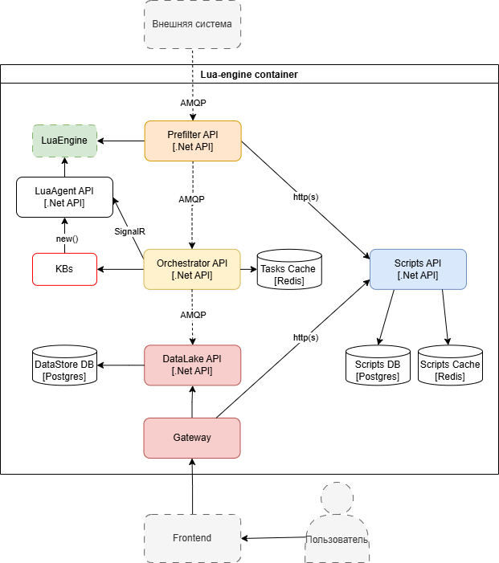

# DSS

## Реализация Lua-движка для обработки данных с интеграций

### Требования
* Система должна выполнять обработку данных с помощью скриптов.
* Система должна позволять пользователям просматривать, добавлять и редактировать правила и скрипты.
* Система должна позволять просматривать результат выполнения скриптов.
* Система должна производить предварительную фильтрацию данных и по правилам определять скрипт, который требуется выполнить для обработки соответствующих данных.
* Система должна поддерживать параллельное выполнение скриптов.
* Система должна получать данные с интеграций через брокер сообщений RabbitMQ.
* Система должна поддерживать версионирование скриптов и правил с возможностью отката к предыдущим версиям.

### Модель предметной области на уровне приложения

### Модель предметной области на уровне хранения

### Описание доменной области и глоссарий

**Основной домен**: Обработка данных с интеграций с использованием пользовательских скриптов.

**Домен Prefilter**: Фильтрация данных по правилам и определение соответствующего скрипта для дальнейшего выполнения.

**Домен Orchestrator**: Распределение выполнения скриптов по агентам. Добавление новых агентов при отсутствии свободных. Удаление агентов при большом числе свободных.

**Домен LuaAgent**: Выполнение скриптов.

**Домен DataLake**: Обеспечение CRUD функционала для результирующих данных после обработки.

**Домен Scripts**: Обеспечение CRUD функционала для скриптов и правил.

***Скрипт***: Код на языке Lua, который применяется для обработки данных.

***Правило***: Код на языке Lua, который применяется для фильтрации данных и содержит связь 1:1 со скриптом.

***Данные***: Модель в виде Json-объекта, приходящая с интеграций.

